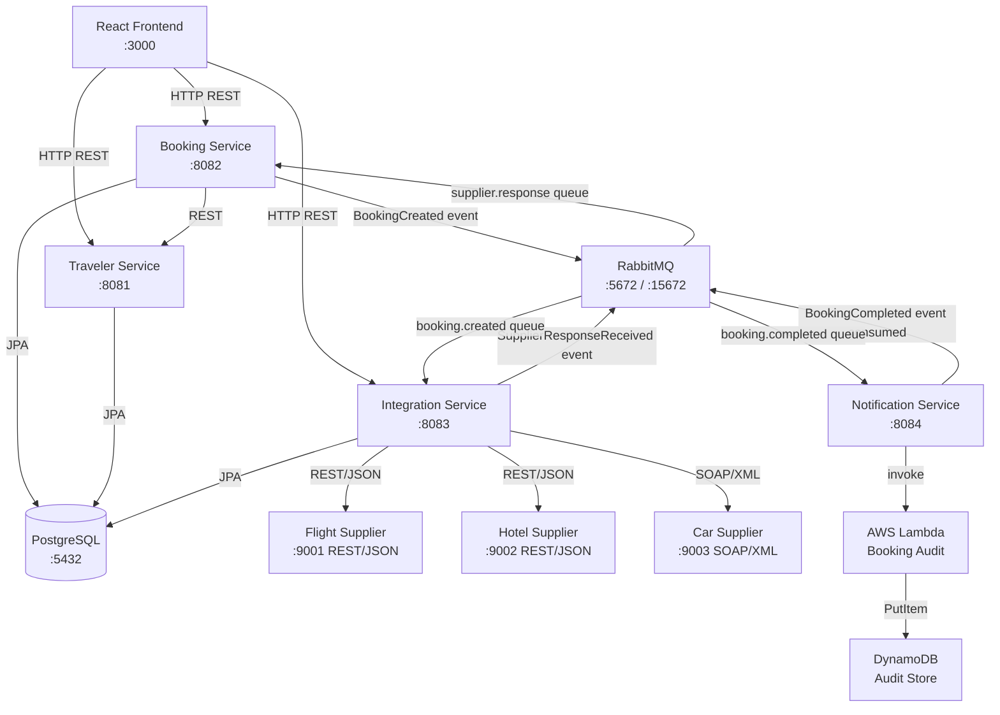
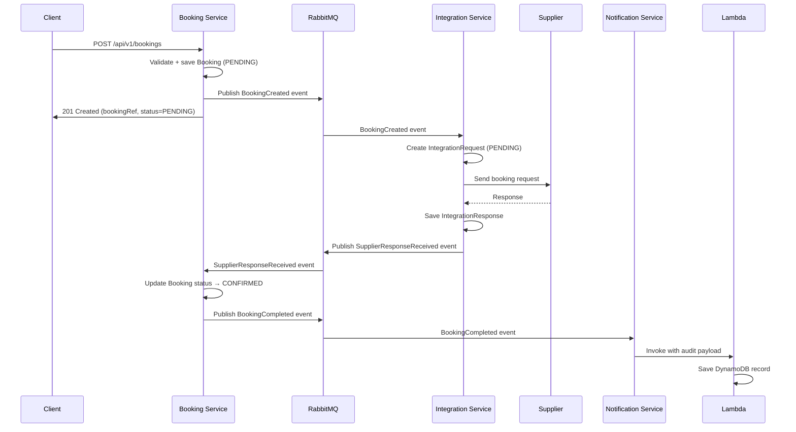

# TravelConnect — System Architecture

## Overview

TravelConnect is a corporate travel booking platform that connects a booking system to multiple external travel suppliers. The platform demonstrates enterprise integration patterns commonly used in the travel technology industry.

## High-Level Architecture



## Component Responsibilities

| Component | Port | Responsibility |
|---|---|---|
| React Frontend | 3000 | User interface — traveler profiles, search, bookings, admin |
| Traveler Service | 8081 | Manages traveler profiles and travel preferences |
| Booking Service | 8082 | Owns trips, bookings, search; publishes events |
| Integration Service | 8083 | Routes requests to suppliers; adapts internal ↔ supplier formats |
| Notification Service | 8084 | Consumes completion events; triggers Lambda audit |
| Flight Supplier (mock) | 9001 | Simulates airline REST/JSON API |
| Hotel Supplier (mock) | 9002 | Simulates hotel REST/JSON API |
| Car Supplier (mock) | 9003 | Simulates car rental SOAP/XML API |
| PostgreSQL | 5432 | Transactional data store |
| RabbitMQ | 5672 | Asynchronous message broker |
| AWS Lambda | — | Serverless audit event processor |
| DynamoDB | — | Audit record store |

## Key Design Decisions

### Why separate services?

Each service has a single bounded context and can be deployed, scaled, and maintained independently:

- **Traveler Service** — profile management is a separate concern from booking logic. It could be replaced with an external Identity/HR system without touching the booking flow.
- **Booking Service** — owns the business lifecycle of a trip. Doesn't know about supplier protocols.
- **Integration Service** — isolates all supplier-specific complexity. Adding a new supplier means adding one new adapter, nothing else.
- **Notification Service** — side effects (email, audit) belong outside the core booking flow.

### Why RabbitMQ (not synchronous calls)?

Calling suppliers synchronously would mean the booking API response waits for three supplier calls (potentially 1-2 seconds each). With RabbitMQ:
- The booking API responds immediately after recording the booking (< 100ms)
- Supplier calls happen in the background
- If a supplier is slow or down, the booking still succeeds — it just stays in PROCESSING status

### Why PostgreSQL for transactional data?

Bookings involve multiple related records (Trip → Booking → BookingItems) that must be written atomically. PostgreSQL's ACID guarantees ensure a booking is never partially saved. DynamoDB is used instead for the audit log because those records are write-once and don't need relational integrity.

### Why the Adapter pattern in Integration Service?

The booking system sends a canonical `SupplierBookingRequest` regardless of supplier. Each adapter converts this to the supplier's specific format:

```
BookingRequest (internal)
     |
     +─→ FlightSupplierAdapter → { JSON request for flight supplier }
     +─→ HotelSupplierAdapter  → { JSON request for hotel supplier }
     +─→ CarSupplierAdapter    → { SOAP/XML for car supplier }
```

This means the booking system is completely decoupled from supplier protocols. Changing a supplier's API only requires modifying its adapter.

## Data Flow: Booking Creation



## Technology Mapping

| Need | Technology | Why |
|---|---|---|
| Core backend | Java 21 + Spring Boot 3.x | Industry standard for enterprise Java |
| Database | PostgreSQL + Flyway | ACID transactions + versioned migrations |
| Async messaging | RabbitMQ | Decouples supplier calls from booking API |
| SOAP integration | XML + WSDL/XSD | Legacy enterprise suppliers still use SOAP |
| Serverless audit | AWS Lambda + DynamoDB | Zero-maintenance audit store |
| Infra-as-code | AWS CDK (TypeScript) | Type-safe cloud infrastructure |
| Containerisation | Docker + Compose | Consistent local-to-production environments |
| CI/CD | Jenkins + GitHub | Industry-standard pipeline |
| Code quality | SonarQube | Static analysis, bug detection |
| API documentation | Spring Actuator + this guide | Operational visibility |
