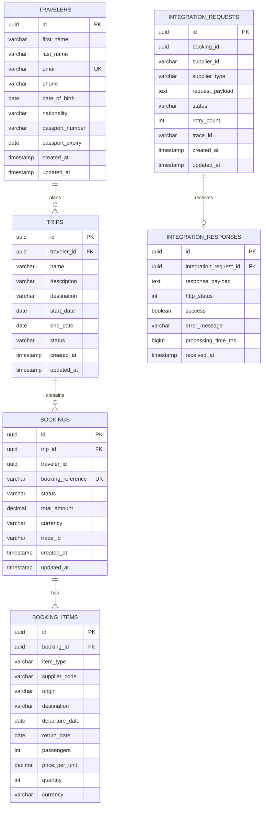

# TravelConnect — Entity Relationship Diagram

## Relational Model (PostgreSQL)

## DynamoDB Audit Table (AWS)

The audit table is intentionally separate from PostgreSQL — it stores immutable event records for compliance and does not need relational integrity.

| Attribute | Type | Key | Notes |
|---|---|---|---|
| `bookingId` | String | Partition Key | UUID of the booking |
| `eventTimestamp` | String | Sort Key | ISO-8601 datetime |
| `travelerId` | String | GSI PK | For querying by traveler |
| `bookingReference` | String | — | e.g. "TC-ABC12345" |
| `eventType` | String | — | e.g. "BOOKING_COMPLETED" |
| `totalAmount` | String | — | Stored as string to avoid decimal precision issues |
| `currency` | String | — | e.g. "GBP" |
| `supplierSummary` | String | — | JSON summary of supplier results |
| `traceId` | String | — | Distributed trace ID |
| `processedAt` | String | — | When Lambda processed the event |
| `ttl` | Number | — | Unix timestamp — records auto-deleted after 90 days |

**Global Secondary Index:** `travelerId-index`
- Partition key: `travelerId`
- Sort key: `eventTimestamp`
- Enables querying all bookings for a given traveler

## Design Decisions

**UUID primary keys everywhere**
UUIDs are generated at the application layer (not the DB). This means:
- IDs are available before the insert completes
- No auto-increment conflicts in a multi-instance deployment
- IDs are globally unique across services

**Booking reference (human-readable)**
`bookingReference` (e.g. `TC-ABC12345`) is separate from the UUID primary key because:
- It's what support teams use in email/phone communication
- It's shorter and pronounceable
- The UUID is for system-to-system use

**trace_id on bookings**
Each booking carries a `trace_id` UUID that propagates through RabbitMQ events to the Integration Service and DynamoDB audit record. This lets you search logs across all services for a single booking end-to-end.

**Separate integration tables**
`integration_requests` and `integration_responses` are separate from the booking tables so that:
- Integration history is preserved even if a booking is deleted
- You can query all failed supplier calls independently of booking status
- The Integration Service can evolve its schema without affecting booking queries

**DynamoDB for audit (not PostgreSQL)**
The audit log is append-only. DynamoDB is ideal because:
- No schema migrations required as audit fields evolve
- Pay-per-request billing — zero cost when idle
- Automatic TTL deletion after 90 days
- Infinitely scalable writes with no connection pool management
