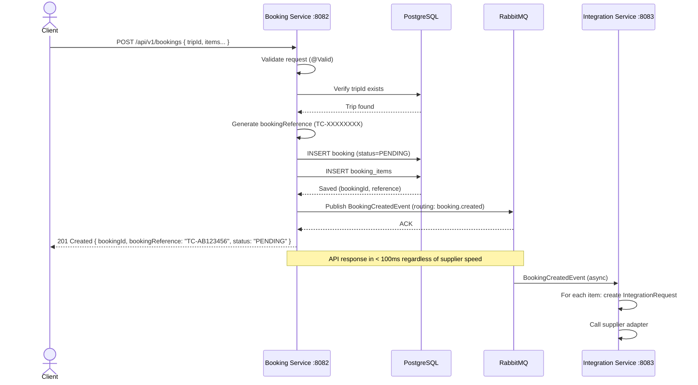
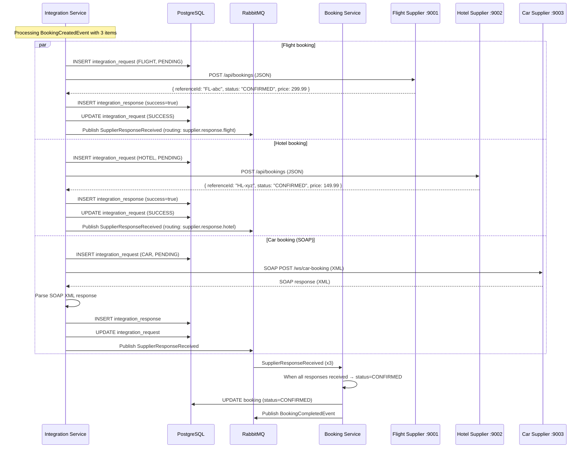
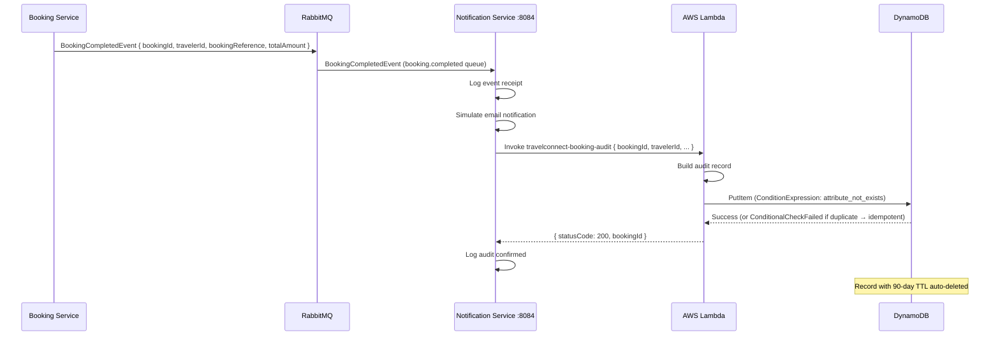
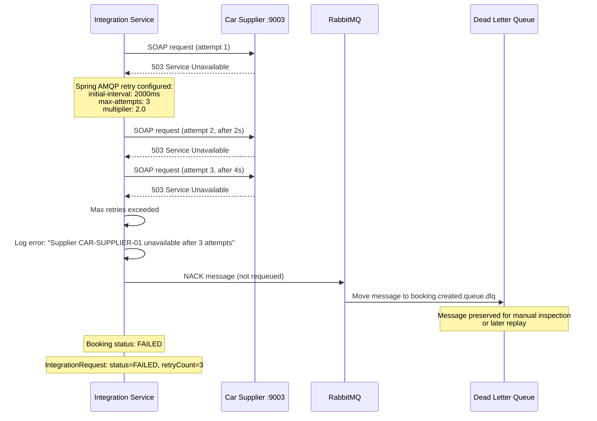
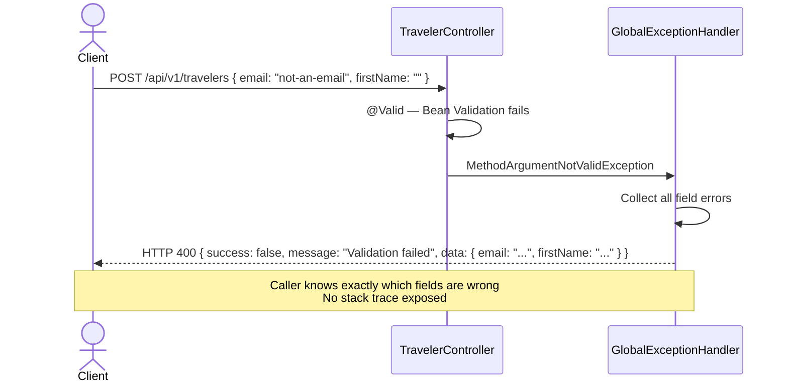

# TravelConnect — Sequence Diagrams

## 1. Creating a Booking

This is the core flow. The key insight is that the API returns immediately after saving the booking — it does NOT wait for supplier responses.

## 2. Supplier Integration Processing

After the booking is created, the Integration Service processes each item asynchronously.

## 3. Booking Completion + AWS Lambda Audit

## 4. Failed Supplier + Retry + Dead Letter Queue

## 5. Validation Error Flow

